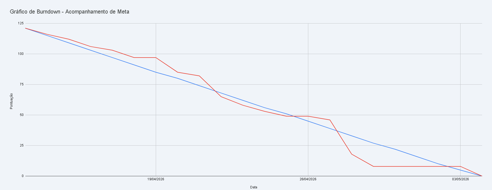

# Sprint 1 — Arquitetura Base

> Sprint dedicada a validar a espinha dorsal técnica do FatecBot de ponta a ponta:
> containers sobem, banco inicializa, seed popula dados, backend responde e o
> frontend consome o menu inicial do chatbot.

***

## Burndown e Demonstração

🎥 **Vídeo de demonstração da Sprint 1:** [Assistir no YouTube/Drive](https://youtu.be/KwbX6P7E774)

***

## Objetivo

Comprovar que a arquitetura base do projeto funciona em fluxo completo antes da
entrada das features mais complexas de autenticação, RBAC e painéis internos.

***

## Entregáveis esperados

- `docker compose up --build` sobe os serviços sem erro
- Banco com schema inicial aplicado
- Seed com usuários de desenvolvimento e nós iniciais do chatbot
- Endpoint `GET /api/v1/health` respondendo
- Endpoint `GET /api/v1/nodes/root` respondendo com o nó raiz e filhos
- Fluxo de login base (`POST /api/v1/auth/login`) documentado e rastreado nas tasks da sprint
- Camada de proteção por JWT/RBAC prevista nas tasks da sprint para rotas sensíveis
- Frontend exibindo o menu inicial carregado da API

***

## Fora do escopo desta sprint

- CRUD administrativo
- Fluxo completo da secretária

Esses itens entram a partir da Sprint 2.

***

## Documentos desta sprint

- [`tasks.md`](./tasks.md) — backlog detalhado da sprint

***

> _Próximo documento: [`tasks.md`](./tasks.md)_
