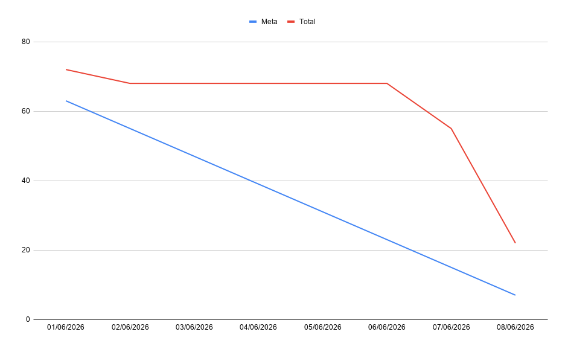

# Sprint 3 — Painel da Secretária e Estabilização

> Sprint voltada à conclusão do MVP: fluxo da secretária, visualização de logs,
> satisfação do atendimento e estabilização da aplicação para demonstração final.

***

## Burndown e Demonstracao

**Link do Burndown da Sprint 3:** [Link Google](https://docs.google.com/spreadsheets/d/1pSj-2_RsHqxcnypaDYe_PIhw74WJXMK6gi8MiMOZ4MY/edit?usp=sharing)

***

## Objetivo

Concluir o escopo do semestre com foco em usabilidade interna, rastreabilidade
das sessões e estabilização da aplicação para demonstração final.

***

## Foco esperado

- Responsividade
- Testes e correções
- Ajustes finais

***

# FatecBot - Sprint 3 · Tabela de Tasks

> **Sprint 3 - Correções e ajustes completo**
> Periodo: 29/05 -- 09/06 · Status: 🟢 Entregue

## Tabela de Rastreabilidade - Sprint 3

**Link da tabela de Tasks com atribuicoes para cada desenvolvedor:** [Tabela de atribuicoes](https://docs.google.com/spreadsheets/d/1pSj-2_RsHqxcnypaDYe_PIhw74WJXMK6gi8MiMOZ4MY/edit?usp=sharing)

> 🎯 **Total Sprint 3: 72 pts** · 24 tasks
> Escala Fibonacci: **1** tipo/config · **2** arquivo simples · **3** logica media · **5 ou 8** multiplos arquivos ou logica complexa

| Task     | Tipo  | Módulo    | Nome                                                         | RFs                        | Prioridade | Pts |
| -------- | ----- | --------- | ------------------------------------------------------------ | -------------------------- | ---------- | --- |
| TASK-084 | BE    | Auth      | Testes de fluxo de autenticação                              | RF09 · RF10 · RF11         | 🟡 Alta    | 5   |
| TASK-085 | BE    | Chatbot   | Testes de fluxo do chatbot                                   | RF01 · RF07 · RF08         | 🟡 Alta    | 5   |
| TASK-086 | FE    | Questions | Testes de fluxo de perguntas                                  | RF05 · RF06 · RF11         | 🟡 Alta    | 5   |
| TASK-087 | FE    | Chatbot   | Testes de navegação do chatbot                                | RF01 · RF07 · RF08         | 🟡 Alta    | 5   |
| TASK-088 | FE    | Auth      | Testes do formulário de login                                 | RF09 · RF10 · RF11         | 🟢 Média   | 3   |
| TASK-089 | DOCS  | Docs      | Diagrama de Classe                                            | —                          | 🟢 Média   | 3   |
| TASK-090 | FE    | Resp      | Responsividade Menu                                           | —                          | 🟢 Média   | 2   |
| TASK-091 | FE    | Resp      | Responsividade Tela Inicial                                   | —                          | 🟢 Média   | 2   |
| TASK-092 | FE    | Resp      | Responsividade Login                                          | —                          | 🟢 Média   | 2   |
| TASK-093 | FE    | Resp      | Responsividade Tela do Chatbot                                | —                          | 🟢 Média   | 3   |
| TASK-094 | FE    | Resp      | Responsividade Admin: Dashboard                               | —                          | 🟢 Média   | 3   |
| TASK-095 | FE    | Resp      | Responsividade Admin: Usuários                                | —                          | 🟢 Média   | 2   |
| TASK-096 | FE    | Resp      | Responsividade Admin: Care                                     | —                          | 🟢 Média   | 2   |
| TASK-097 | FE    | Resp      | Responsividade Admin: Tickets                                 | —                          | 🟢 Média   | 2   |
| TASK-098 | FE    | Resp      | Responsividade Admin: Histórico                               | —                          | 🟢 Média   | 2   |
| TASK-099 | FE    | Resp      | Responsividade Admin: Configuração                            | —                          | 🟢 Média   | 2   |
| TASK-100 | FE    | Chatbot   | Administrador: Configuração                                   | —                          | 🟢 Média   | 3   |
| TASK-101 | FE    | Resp      | Responsividade Secretaria: Dashboard                          | —                          | 🟢 Média   | 3   |
| TASK-102 | FE    | Resp      | Responsividade Secretaria: Tickets                            | —                          | 🟢 Média   | 2   |
| TASK-103 | FE    | Resp      | Responsividade Secretaria: Histórico                          | —                          | 🟢 Média   | 2   |
| TASK-104 | FE    | Resp      | Responsividade Secretaria: Configuração                       | —                          | 🟢 Média   | 2   |
| TASK-105 | FE    | Chatbot   | Secretaria: Configuração                                       | —                          | 🟢 Média   | 3   |
| TASK-106 | FE    | Admin     | Correções ortográficas: parte do Administrador                 | —                          | 🟢 Média   | 3   |
| TASK-107 | FE    | Secretaria| Correções ortográficas: parte da Secretaria                 | —                          | 🟢 Média   | 3   |
| TASK-108 |DOCS   |Docs       |Burndown Sprint 3                                           |  —                           | ⚪ Baixa   |3       |

---

## Principios de Leitura

| Simbolo   | Significado                                                                              |
| --------- | ---------------------------------------------------------------------------------------- |
| `[BE]`    | Task de backend (`apps/backend/`)                                                        |
| `[FE]`    | Task de frontend (`apps/frontend/`)                                                      |
| `[INFRA]` | Task de infraestrutura (raiz do monorepo)                                                |
| `[FIGMA]` | Task de design de interface                                                              |
| `[UML]`   | Task de modelagem UML com Astah (artefato externo versionado no time)                    |
| `[DB]`    | Task de modelagem de banco de dados com dbdesigner (artefato externo versionado no time) |
| `[DOCS]`  | Task de documentacao                                                                     |

> Use `docs/fatecbot-backlog.md` para o detalhamento completo das tasks e rastreabilidade.
